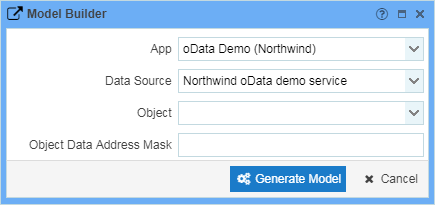

# Generating a metamodel from OData $metadata

Each OData service has a $metadata document, that describes it's entities, functions, etc. The $metadata is similar to the metamodel and can be easily used to generate objects, attributes and actions in it.

Once you have [created a data source and a corresponding connection](setting_up_an_oData_data_source.md), you can proceed with importing the $metadata as shown below.

## Importing $metadata

You can import the entire $metadata of your OData service by running the model builder on your data source. Go to Administration > Metamodel > Data Sources, select your OData source and start the model builder.

Just press "Generate Model" to import the entire $metadata. You can also a specific entity type name as data address mask to generate a model for this entity type only. Refer to the documentation of the ODataModelBuilder for more details (Administration > Documentation > Model Builders).

## Importing changes

Running the model builder (again) on an existing model will import entity types, functions and actions, that are not present in the model yet. Existing meta objects will not get updated.

To update a specific meta object (e.g. to import new entity type properties), you will need to select it in the model builder explicitly or run the model builder for the meta object in Administration > Metamodel > Objects. However, the model builder will never import changes to existing attributes because it cannot know, if the metamodel was changed intentionally or the change originates from an update of the OData $metadata.

## Enhancing the model

SAP OData services have an enhanced $metadata document (compared to "regular" OData) with additional information like filterable/sortable-flags, etc. This information is used by the model builder to set the corresponding properties in the metamodel. Unfortunately this information is often inaccurate because it needs to be set explicitly in SAP (many developers don't do that). 

While the model will work after it was imported (e.g. you will be able to create a table an let it show an EntitySet), many built-in features of the UI like generic filtering, header-sorting, relation-combos, etc. may not work properly. This may even get really frustrating for the users because SAP OData services do not automatically produce meaningfull errors. Thus, if you try filtering an EntitySet over a property without implemented filtering functionality, most services will just provide an empty result or even simply ignore the filter. The user of the UI would have no chance to understand, what happened!

So in most cases it is absolutely neccessary to take a closer look on the metamodel after it had been generated. Please read the general (non-SAP) [OData model documentation](https://github.com/exface/urldataconnector/blob/master/Docs/OData/the_metamodel_for_odata.md) before you continue with the [SAP-specific finetuning](metamodel_finetuning.md) docs.

