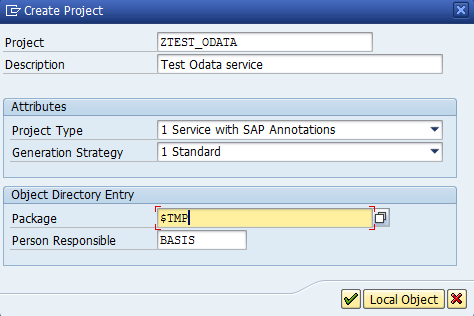
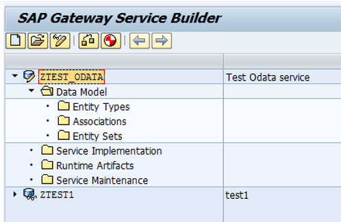
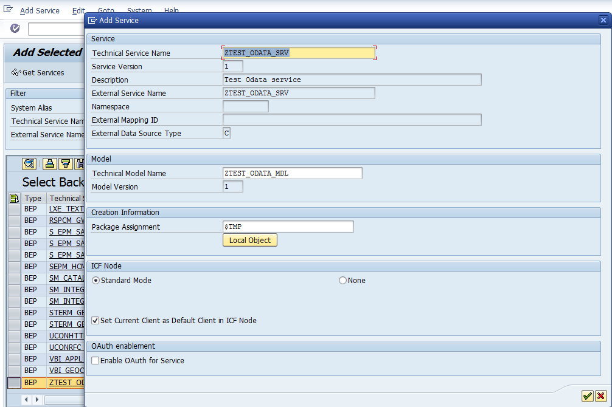
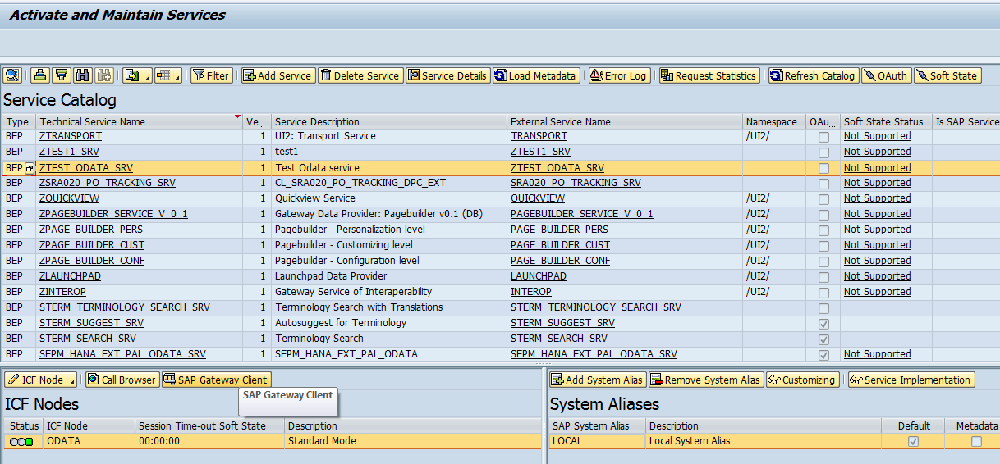
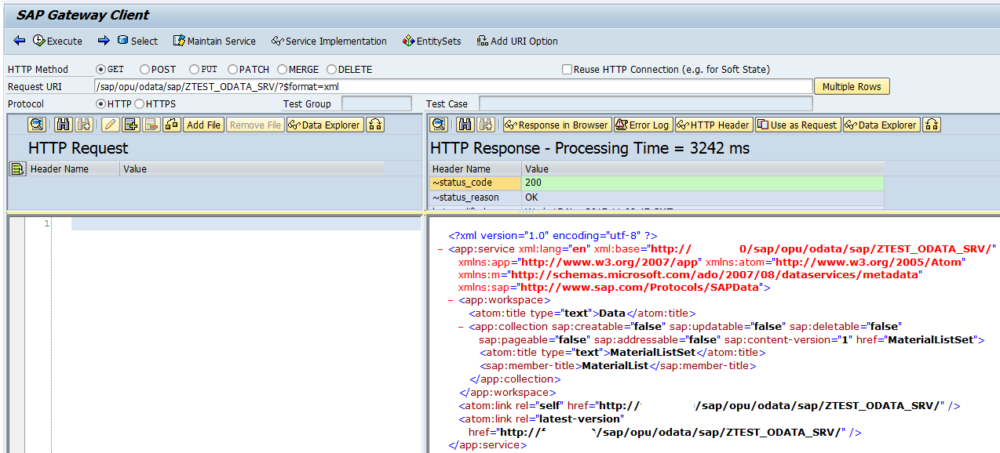

# How to create an OData 2.0 service in SAP

SAP comes with really few ready-made OData services to use, so you can be sure, that you will need to create one for your specific needs yourself. This tutorial will guide you through the creation of a simple OData service based on a CDS-view.

**Requirements**: 
- SAP NetWeaver release 7.4 or later!
- Eclipse [SAP Development Tools](https://tools.hana.ondemand.com/)

## 1. Create a CDS-view as data source

**NOTE:** CDS-views can only be created using Eclipse! 

1. Create/open the project for your SAP instance in Eclipse
2. Right-click the package name (top level in Eclipse Project explorer) and select `New > Other ABAP Repository Object > Core Data Services > Data Definition`
3. Enter name, description and package (e.g. `$TMP`)
4. Press `Next`. Here you can select a template to use. The default is OK for now.
5. Press `Finish`
6. Replace the placeholders in the template and write the SQL

Example:

```
@AbapCatalog.sqlViewName: 'ZTEST_ODATA_EKPO'
@AbapCatalog.compiler.compareFilter: true
@AbapCatalog.preserveKey: true
@AccessControl.authorizationCheck: #CHECK
@EndUserText.label: 'Purchase order positions'
define view ZTEST_ODATA_EKPO as select from ekko
    inner join      ekpo on ekko.ebeln = ekpo.ebeln
    left outer join lfa1 on lfa1.lifnr = ekko.lifnr
    left outer join mara on mara.matnr = ekpo.matnr
    left outer join makt on makt.matnr = mara.matnr
    left outer join adrc on adrc.addrnumber = lfa1.adrnr
{
  key ekko.ebeln  as EBELN,
  key ekpo.ebelp  as EBELP,
      ekko.bukrs  as BUKRS,
      ekpo.netwr  as NETWR,
      ekpo.menge  as MENGE,
      lfa1.lifnr  as LIFNR,
      lfa1.name1  as NAME1,
      lfa1.adrnr  as ADRNR,
      mara.matnr  as MATNR,
      makt.maktx  as MAKTX,
      adrc.city1  as CITY1,
      adrc.street as STREET
}
```

Use the `key` prefix for every field that is to be part of the primary key of the view.

## 2. Create a project in `SEGW`



1. Open transaction `SEGW`
2. Press the upper left icon `Create project`
	- Enter project name and description and a package (e.g. `$TMP`)
3. Click the `OK` icon
4. Now a new OData project is created



## 3. Generate an OData `EntitySet` from the CDS-view

1. In the project tree richt-click `Data Model` and select `Reference > Data Source`.
2. Search for your CDS-view
3. Press `Generate runtime objects`
4. Now you have an OData `Entity` and a corresponding `EntitySet`, that already supports pagination and sorting.

## 4. Implement other logic if required

While reading data may be pretty easy using CDS-views, other logic like creating, updating, deleting or anything else, must be implemented manually. 

There are basically two options:

- [Implement one of the methods in the generated classes](Implementing_OData_CRUD_logic.md): e.g. to create, update or delete entities
- [Add an OData FunctionImport](Implementing_custom_OData_logic_via_FunctionImport.md) to be able to call any logic with arbitrary parameters

## 5. Register the OData Service

1. Open transaction `/n/iwfnd/maint_service` to see all services currently registered
2. Press `Add Service`
3. Enter system alias `LOCAL` and press `Get Services` to see all unregistered services
4. Find your project created above
5. Press `Add Selected Services`
6. Specify a package in the opened dialog window (e.g. `$TMP`)

	

7. Click on the `OK` icon
8. Once the serivce is registered, you will see a success-popup. Click the `OK` icon here too
9. Go `back` one step to the list of registered services
10. Find your new service in the table

	

11. You can test it now by pressing `SAP Gateway Client` for the corresponding ICF node in the left section below the table.

	

You can also open the gateway client directly via `/n/iwfnd/gw_client`.

**IMPORTANT:** You will need the URL to your OData service to create a data connection for the workbench. You can get the URL easily by clicking on `Call browser` for the ICF node in step 10 above. **But** be sure to use the ICF `ODATA` ICF node, not `SDATA` or others!

